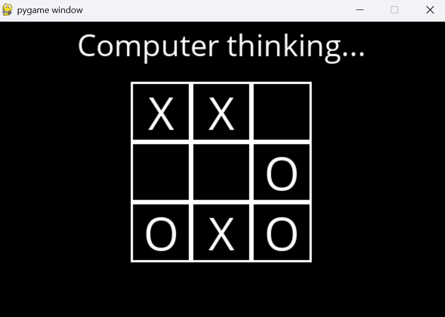

# AI Tic Tac Toe

A graphical Tic Tac Toe game featuring an AI agent that plays optimally using the **Minimax algorithm**.

This project was developed as part of **Harvard's CS50 Introduction to Artificial Intelligence with Python (CS50AI)** and includes a Pygame-based graphical interface.

(Builds upon my previous [1v1 Tic Tac Toe project](https://github.com/dvtkdlwl/1v1_TicTacToe))

---

  

## Features
- Single-player gameplay against an optimal AI
- AI powered by the Minimax algorithm (never loses)
- Graphical user interface built with Pygame
- Play as either X or O
- Restartable game session

---

## Technologies Used
- Python 3
- Pygame
- Minimax algorithm (adversarial search)

---

## Project Structure

AI_TicTacToe/
- runner.py        (Pygame GUI and game loop)
- tictactoe.py     (Game logic and Minimax AI)
- OpenSans-Regular.ttf
- README.md

---

## How to Run

### Prerequisites
- Python 3.x
- Pygame

Install Pygame:
pip install -r requirements.txt

Run the game:
python runner.py

---

## How to Play
1. Launch the game window
2. Choose whether to play as X or O
3. Click on a square to place your move
4. The AI will automatically respond
5. The game ends when a player wins or the board is full
6. Click **Play Again** to restart

---

## AI Behavior
- The AI uses the Minimax algorithm to evaluate all possible game states.
- It always selects the optimal move.
- The AI cannot be beaten, only tied!

---

## Note
This code is shared for educational and portfolio demonstration purposes.
Some structural components are based on coursework provided by Harvard’s CS50 AI.
This repository is not intended for reuse as assignment solutions.

---
